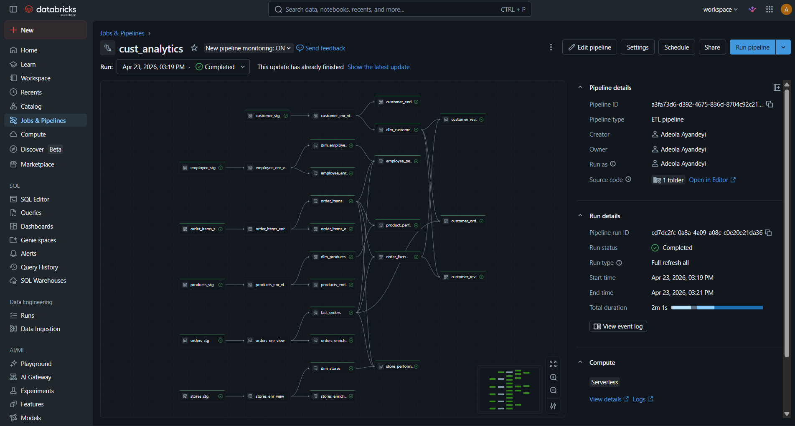

🛍️ Retail Insight Data Platform

An end-to-end modern data platform built on Databricks using Delta Live Tables (DLT) and Databricks Asset Bundles (DAB) to deliver reliable, scalable, and production-grade retail analytics.

📌 Overview

The Retail Insight Data Platform is designed to ingest, transform, and serve retail data for analytics and reporting. It implements a multi-layer medallion architecture with automated data pipelines and supports both SCD Type 1 and SCD Type 2 transformations.

Key Objectives:
- Build a robust ETL pipeline using modern Databricks Declarative Pipeline
- Enable historical tracking of customer and product changes
- Ensure data quality and reliability using DLT expectations
- Automate deployment using infrastructure-as-code principles.

Business Requirement
The business requirements is to analyze

- Customer Orders: Number of orders placed by each customer
- Employee Performance: Top employee based on revenue and total orders
- Product Performance: Compute the revenue generated by each product
- Store performance:  Store performance based on the total orders from each store
- Customer Revenue: Revenue generated from each customer and total orders

The datasets are:

- Customers
- Orders
- OrderItems
- Stores
- Employees
- Products

🏗️ Architecture and ETL Pipeline Design

The platform follows the Medallion Architecture:

**Landing Layer (Bronze)**
- Raw ingestion of data with Delta Live tables. The streaming tables are utilized for the ingestion of data
- DLT expectations are built in for data quality checks
- The ingested data are stored in the Landing Schema of custoer_data_analytics catalog

Processing Layer (Silver - SCD Type 1)

- The data are transformed and cleaned and stored in dlt views
- Upsert tables are created in the silver layer using auto cdc
- A view is dlt view is created to store the transfeormed data. A streaming table is then created on top of this view for SCD type 1 upsert. This is so because streaming tables cannot use a source which changes. Since upsert table changes, we create a view which ingest new data.
- DLT expectations are built in for data quality checks
- A streaming table is created with auto cdc  to implement the SCD Type 1 data for each of the data ingested, which allows latest records to replace previous values. In the auto_cdc_flow, the source data( which is the ingested data) is specified, the target (which is the enriched data) is specified, the key, which is the id column of the data, sequence_by (usually the date column) and the store_scd_type (in this case is 1) are also specified. The data here are the enriched data

**Dimensional Data Models**

- Data models are created from the silver layer data to ensure SCD Type 2 data are created for the comsumption layer.
Here, streaming tables are created from the enriched data (Silver layer data).

**Consumption Layer (Gold - SCD Type 2)**
Business-ready datasets are created using the data models. The enabled historical tracking is done in the data models.
The business-ready datasets are:
- Customer Orders: Number of orders placed by each customer
- Employee Performance: Top employee based on revenue and total orders
- Product Performance: Compute the revenue generated by each product
- Store performance:  Store performance based on the total orders from each store
- Customer Revenue: Revenue generated from each customer and total orders

⚙️ Tech Stack
Platform: Databricks
Pipeline Framework: Delta Live Tables
Deployment: Databricks Asset Bundles
Storage: Delta Lake
Language: Python / SQL
Orchestration: Native DLT pipeline scheduling

The pipeline is implemented using Delta Live Tables to provide:

Features:
- Declarative pipeline development
- Built-in data quality checks (Expectations)
- Automatic dependency resolution
- Incremental processing

📦 Deployment with Databricks Asset Bundles

The project uses Databricks Asset Bundles for consistent and repeatable deployments.

Key Features:
Environment-based deployments (dev, prod)
Parameterized configurations (e.g., catalog_name)
CI/CD friendly structure
Github Deployement

Databricks bundle is initialized with a project name (called  "retail-insight-platform" in this project) using the databricks web terminal

The project is created with the required files:

 databirks.yml: This is the main bundle configuration
 variables.yml: This is where reusable variables are configured. To make the catalog variable dynamic.
 resources: Stores the yml files for the pipleines and job  configurations
 src: This is where the ETL architecture is stores, such as the Landing folder, the Processing Folder and the Consumption folders with their python/ SQL files for ETL pipleine

The project is deployed into Git Folders (previously referred to as Databricks Repos).
The Git repo is set up with databricks by creating a linked service with your dedicated github account.
Deploy the project and commit the changes in the repo to ensure that the pushed to the github repo.